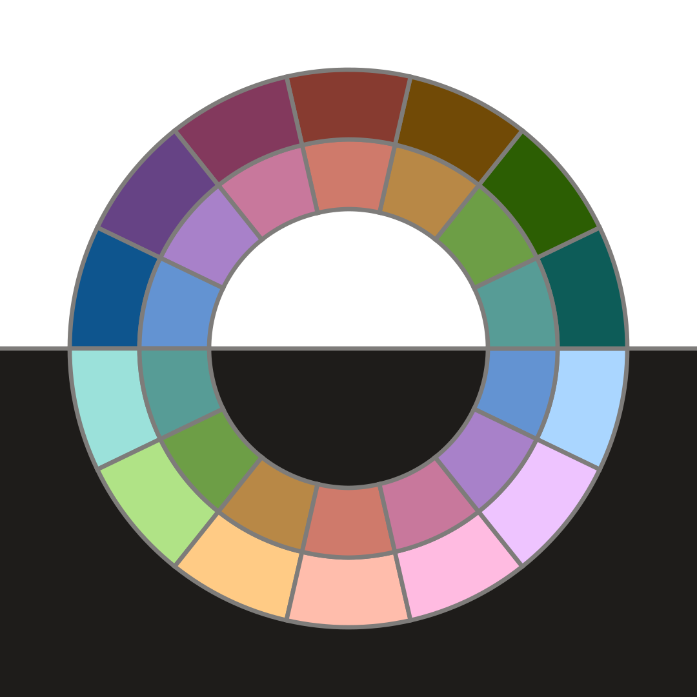

# workmanlike

A light first white background color theme for bright digital workmanship.

## Colors

### blue

`#0e558e`
`#6393d2`
`#aad6ff`

### purple

`#664385`
`#a881c9`
`#eec4ff`

### pink

`#83395d`
`#c8789c`
`#ffbbe1`

### red

`#873b30`
`#cf7a6b`
`#ffbdac`

### yellow

`#714a06`
`#b88846`
`#ffcb85`

### green

`#2c5e03`
`#6d9e46`
`#b0e386`

### teal

`#0d5c58`
`#579c96`
`#9be1da`

## Development Process

The base colors were selected by eyeballing the colors and tweaking via RGB and HSV until they felt right. This was an extended personal process during which I used the standard light version as my code syntax highlighting theme ensuring I get daily exposure.

Afterward CIELAB was used normalize the lightness of the color variants to 35, 60, and 85. This required the baseline 60 lightness variant to have an RGB minimum of 70 and an RGB maximum of 210 to avoid shifts in color for dark and light variants respectively. A small amount of color tweaking was necessary therefore.
